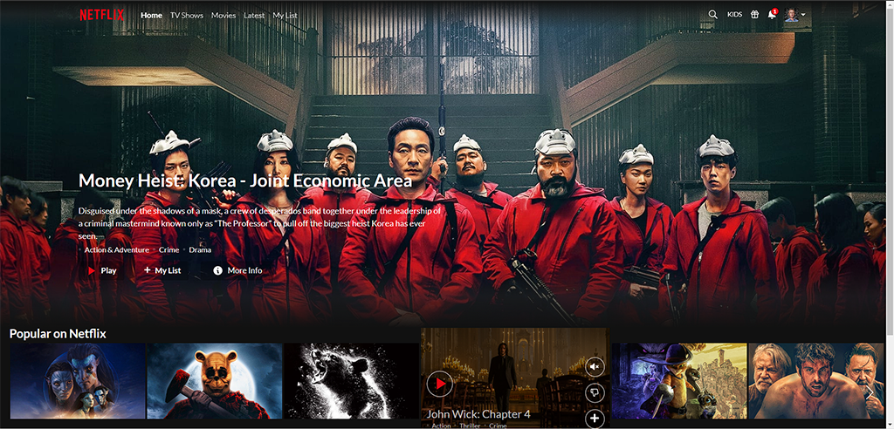

# Netflix clone movie app based on [TMDB API </h1>](https://developer.themoviedb.org/docs/getting-started "TMDB API website link")

 🚀 **[THIS IS A LINK TO THE WORKING APP](https://petnetflix.vercel.app/)** 🚀

&nbsp;
&nbsp;
&nbsp;
&nbsp;
&nbsp;
&nbsp;
&nbsp;

